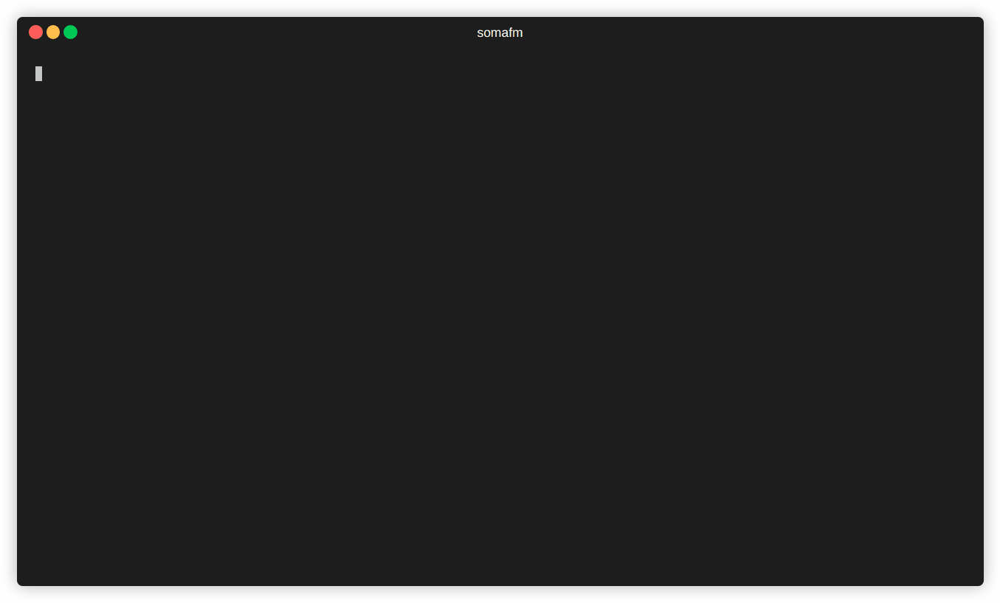

# somafm

> CLI application to listen to SomaFM stations



If you enjoy listening to [SomaFM](https://somafm.com/) please support SomaFM by donating.

## Installation

### Install manually from release

1. [Download the latest release for your platform](https://github.com/kromin/somafm/releases)
2. Install to a location in your `$PATH`

### Install manually from source

1. Ensure go is installed
2. Clone this repo and run `cd somafm`
3. Run `go build cmd/somafm.go`
4. Copy the executable to a location in your `$PATH`

## Usage

```sh
somafm
```
## Navigation

Press `1` to go to Channels
Press `2` to go to Control (Play/Pause + Volumes)
